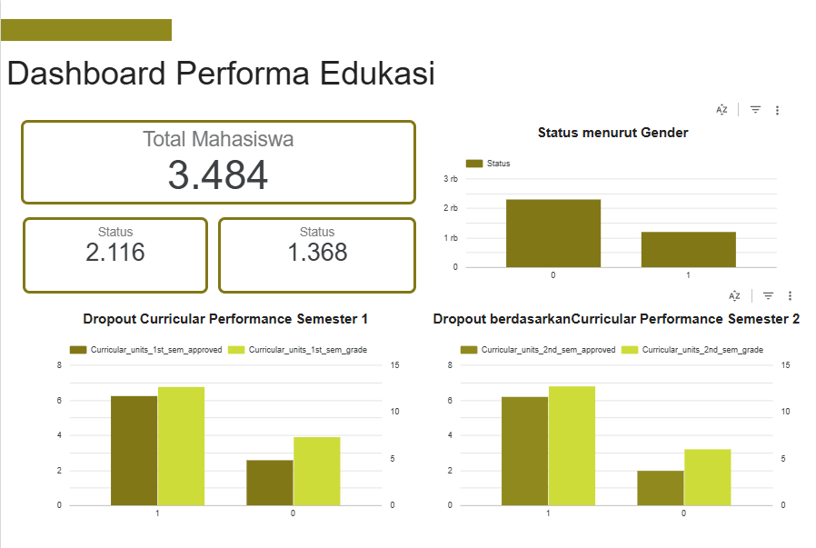

# Proyek Akhir: Menyelesaikan Permasalahan Perusahaan Jaya Jaya Maju

## Business Understanding

Jaya Jaya Institut merupakan salah satu institusi pendidikan perguruan yang telah berdiri sejak tahun 2000. Hingga saat ini ia telah mencetak banyak lulusan dengan reputasi yang sangat baik. Akan tetapi, terdapat banyak juga siswa yang tidak menyelesaikan pendidikannya alias dropout.

Jumlah dropout yang tinggi ini tentunya menjadi salah satu masalah yang besar untuk sebuah institusi pendidikan. Oleh karena itu, Jaya Jaya Institut ingin mendeteksi secepat mungkin siswa yang mungkin akan melakukan dropout sehingga dapat diberi bimbingan khusus.

### Permasalahan Bisnis
Tingkat dropout mahasiswa di Jaya Jaya Institut tergolong tinggi, yang dapat:
- Penurunan reputasi institusi.
- Dampak negatif pada akreditasi dan kepercayaan publik.
- Kerugian finansial akibat hilangnya pemasukan dari mahasiswa.
- Beban tambahan pada proses akademik dan administrasi.

### Cakupan Proyek
- Memprediksi kemungkinan dropout mahasiswa menggunakan data historis akademik dan non-akademik.
- Visualisasi monitoring dropout secara real-time untuk membantu pengambilan keputusan oleh pihak kampus.

### Cakupan Fungsional Proyek
1. Pengolahan Data Mahasiswa
   - Pembersihan dan normalisasi data akademik dan keuangan.
   - Transformasi data kategorikal (misalnya gender) dan numerik (misalnya nilai) menjadi format siap model.

2. Model Prediksi Dropout
Training model menggunakan Random Forest Classifier, Fitur yang digunakan meliputi:
   - Jenis kelamin
   - Nilai rata-rata semester 1
   - Nilai rata-rata semester 2
Model disimpan dalam bentuk .joblib bersama encoder untuk keperluan inferensi otomatis.

3. Antarmuka Prediksi (Streamlit)
   - Form input interaktif untuk memasukkan data mahasiswa baru.
   - Prediksi dropout ditampilkan secara real-time dengan visual feedback.

4. Dashboard Monitoring Dropout (Looker Studio)
Visualisasi dropout berdasarkan faktor-faktor utama:
   - Nilai akademik (semester 1 & 2)
   - Jenis kelamin
Tampilan:
   - Jumlah total dropout
   - Distribusi dropout berdasarkan gender
   - Perbandingan nilai rata-rata mahasiswa dropout vs tidak dropout.

5. Penyimpanan Data di PostgreSQL
Seluruh data mahasiswa dan hasil prediksi disimpan dalam PostgreSQL. Basis data ini menjadi sumber utama untuk Looker Studio melalui koneksi terintegrasi (via Google Cloud Connector atau service account).

6. Integrasi dengan Google Looker Studio


### Persiapan
| Jenis      | Keterangan                                                                 |
|------------|------------------------------------------------------------------------------|
| Title      | Jaya Jaya Institut                                                   |
| Source     | [github](https://github.com/dicodingacademy/dicoding_dataset/tree/main/students_performance) |
| Visibility | Public                                                                      |

Setup environment:

### 1. Buat Conda Environment

```bash
conda create -n education-performance python=3.10 -y
conda activate education-performance
```

### 2. Install Dependensi

```bash
pip install -r requirements.txt
```

Menjalankan predict dropout
### 1. Clone Repository

```bash
git clone https://github.com/Sintasitinuriah/education-performance.git
cd education-performance
```
### 2. Menjalankan Aplikasi Streamlit

```bash
streamlit run pred_dropout.py
```

# Data Understanding
Dataset ini berisi informasi akademik, administratif, dan demografis mahasiswa. Dimana kolom yang dijelaskan pada bagian ini adalah yeng mempunyai korelasi tinggi terhadap keputusan dropout.

| Kolom                               | Deskripsi                                                                 |
|------------------------------------|---------------------------------------------------------------------------|
| `Application_mode`                 | Jalur pendaftaran mahasiswa (numerik yang merepresentasikan mode tertentu) |
| `Gender`                           | Jenis kelamin (1 = Laki-laki, 0 = Perempuan)                             |
| `Age_at_enrollment`               | Usia mahasiswa saat mendaftar (dalam tahun)                              |
| `Debtor`                           | Status hutang pendidikan (1 = Ya, 0 = Tidak)                              |
| `Scholarship_holder`              | Status penerima beasiswa (1 = Ya, 0 = Tidak)                              |
| `Tuition_fees_up_to_date`         | Apakah pembayaran SPP tepat waktu (1 = Ya, 0 = Tidak)                     |
| `Curricular_units_1st_sem_approved` | Jumlah mata kuliah yang lulus di semester 1                             |
| `Curricular_units_1st_sem_grade`  | Nilai rata-rata semester 1                                               |
| `Curricular_units_2nd_sem_approved` | Jumlah mata kuliah yang lulus di semester 2                             |
| `Curricular_units_2nd_sem_grade`  | Nilai rata-rata semester 2                                               |
| `Status`                           | Status akhir mahasiswa (1 = Graduate, 0 = Dropout, 2=Enroll)                        |

## 1. Bivariate - EDA
Pada bagian ini diberikan visualisasi antara dua komponen menggunakan crosstab, scatterplot dan bosplot
## 2. Multivariate - EDA
pada bagian ini diberikan visualisasi antara beberapa komponen yang saling berkiatan menggunakan Marix Korelasi, Pairplot dan Violinplot
## 3. Pengecekan Missing Values, Duplicated dan Outliers
- Dataset ini tidak memiliki missing value
- Dataset ini tidak memiliki data yang duplikat 
- Dataset memiliki outliers dan visualisasikan dengan boxplot
# Data Preparation

## 1. Mengatasi Outliers
Outliers adalah nilai ekstrem yang jauh dari distribusi umum data. Kehadiran outliers dapat mengganggu proses pelatihan model, terutama dalam algoritma yang sensitif terhadap distribusi data. Mengurangi distorsi pada statistik dan model yang dihasilkan, serta meningkatkan stabilitas dan akurasi model. pada model ini menggunakan pendekatan Interquartile Range (IQR). IQR merupakan metode statistik yang mengukur sebaran tengah data dan mengidentifikasi nilai-nilai yang berada jauh di luar rentang normal

## 2. Encoding Data Kategorikal
Beberapa fitur dalam dataset bersifat kategorikal (bukan numerik), seperti `Status` agar fitur ini dapat digunakan oleh algoritma machine learning (yang umumnya hanya menerima input numerik), dilakukan proses encoding, yaitu mengubah nilai kategorikal menjadi numerik. 

## 3. Seleksi Fitur (Feature Selection)
Seleksi fitur adalah proses memilih subset dari fitur yang paling relevan terhadap target. Terlalu banyak fitur yang tidak penting dapat menyebabkan overfitting. Meningkatkan performa model, mengurangi waktu pelatihan, dan mencegah kompleksitas berlebih yang dapat menurunkan generalisasi model. Pada Selection Feature ini diambil dengan menghitung nilai korelasi tertinggi.

Fitur terpilih: ['Curricular_units_2nd_sem_approved', 'Curricular_units_2nd_sem_grade', 'Curricular_units_1st_sem_approved', 'Curricular_units_1st_sem_grade']

## 4. Splitting Data
Splitting data adalah proses membagi dataset menjadi data pelatihan dan data pengujian. Ini penting untuk mengevaluasi kinerja model secara adil.Untuk memastikan bahwa performa model diuji pada data yang belum pernah dilihat, sehingga mencerminkan kemampuannya dalam generalisasi.

## 4. Standarisasi
Standarisasi adalah proses menyamakan skala dari fitur-fitur numerik. Banyak algoritma machine learning bekerja optimal ketika fitur memiliki skala yang seragam. Meningkatkan kinerja dan konvergensi algoritma yang sensitif terhadap skala, seperti KNN, SVM, dan PCA.

## 6. SMOTE (Synthetic Minority Over-sampling Technique)
SMOTE adalah teknik untuk mengatasi masalah ketidakseimbangan kelas dengan membuat data sintetis dari kelas minoritas melalui interpolasi. Berfungsi untuk meningkatkan kemampuan model dalam mempelajari pola dari kelas minoritas, yang sering kali terabaikan dalam data tidak seimbang.


# Model Development
## Random Forest Classifier (RFC)
Random Forest Classifier (RFC) adalah bagian dari algoritma ensemble learning yang digunakan untuk klasifikasi data. Algoritma ini bekerja dengan membangun banyak pohon keputusan (decision trees) dan menggabungkan hasilnya (voting) untuk menentukan kelas akhir.

### Cara Kerja Random Forest
- Membuat banyak decision tree dari subset acak data dan fitur.
- Setiap pohon membuat prediksi sendiri.
- RFC mengambil hasil mayoritas dari seluruh pohon (voting) sebagai hasil akhir klasifikasi.

Dalam proyek ini, RFC digunakan untuk memprediksi apakah seorang mahasiswa akan dropout atau tidak berdasarkan data akademik dan demografis.

### Kelebihan Random Forest
- Lebih tahan terhadap overfitting dibanding satu pohon keputusan.
- Dapat menangani data kategorikal dan numerik tanpa perlu normalisasi rumit.
- Cocok untuk prediksi dropout, karena bisa menangkap pola kompleks antara berbagai faktor.

----
# Evaluation
## Clasification Report
**Classification Report** adalah ringkasan metrik evaluasi untuk model klasifikasi. Laporan ini memberikan wawasan tentang kinerja model dengan membandingkan label yang diprediksi terhadap label sebenarnya.
Classification Report biasanya mencakup metrik berikut untuk setiap kelas:

| **Metrik**  | **Deskripsi**                                                                                   |
|-------------|--------------------------------------------------------------------------------------------------|
| **Precision** | Proporsi prediksi positif yang benar-benar benar (True Positive / (True Positive + False Positive)) |
| **Recall**    | Proporsi data positif yang berhasil diprediksi dengan benar (True Positive / (True Positive + False Negative)) |
| **F1-score**  | Rata-rata harmonis dari precision dan recall, berguna saat ingin seimbangkan keduanya          |
| **Support**   | Jumlah kemunculan aktual dari masing-masing kelas dalam data                                   |

**Hasil Classification SVC** pada model ini adalah sebagai berikut:

                        precision    recall  f1-score   support

               0          0.82      0.78      0.80       274
               1          0.86      0.89      0.88       423

         accuracy                             0.85       697
         macro avg        0.84      0.84      0.84       697
      weighted avg        0.85      0.85      0.85       697

## Business Dashboard


Untuk mempermudah pemantauan dan analisis  performa siswa secara berkala, telah dibuat sebuah dashboard interaktif menggunakan looker studio: [dashboar edukasi](https://lookerstudio.google.com/reporting/9c2cb1f5-a794-419c-87cd-0f5fcb6da818). Dashboard ini menyajikan visualisasi data yang intuitif dan informatif mengenai faktor-faktor yang mempengaruhi performa siswa, seperti:

- Distribusi perfroma siswa berdasarkan Gender
- Faktor mempengaruhi dropout seperti nilai semester 1 dan 2, kelulusan mata kuliah semester 1 dan 2.

## Solusi Machine Learning
Solusi machine learning ini dikembangkan sebagai alat bantu awal bagi Jaya Jaya Institut untuk memprediksi kemungkinan dropout mahasiswa berdasarkan data historis akademik dan administratif.

Aplikasi dibangun menggunakan Streamlit dan berfungsi sebagai dashboard interaktif sederhana yang memiliki dua fitur utama:

    - Prediksi Status Mahasiswa (Dropout / Graduate)

    - Pengguna dapat memasukkan data individual mahasiswa melalui form input.

    - Model prediksi menggunakan algoritma Random Forest Classifier dengan parameter `random_state = 42`.
    
    - Output yang ditampilkan berupa status: Dropout atau Graduate.

🎯 Akses aplikasi online: [pred_app](https://education-performance.streamlit.app/)

## Conclusion
Melalui analisis dan implementasi model prediksi dropout menggunakan algoritma Support Vector Classifier (SVC), proyek ini berhasil mengidentifikasi faktor-faktor penting yang memengaruhi kemungkinan mahasiswa untuk tidak menyelesaikan studinya.

Beberapa temuan utama:
1. Mahasiswa dengan jumlah mata kuliah yang lulus lebih sedikit, terutama di semester pertama, memiliki risiko lebih tinggi untuk dropout.
2. Status keuangan juga berpengaruh: mahasiswa yang tidak membayar uang kuliah tepat waktu atau memiliki status debtor cenderung memiliki proporsi dropout yang lebih tinggi.
3. Faktor seperti status beasiswa, jenis kelamin, dan usia saat pendaftaran juga memberikan pengaruh signifikan terhadap hasil prediksi.

Dengan visualisasi dan dashboard interaktif, institusi seperti Jaya Jaya Institut dapat:
1. Melakukan pemantauan real-time terhadap potensi dropout mahasiswa.
2. Memberikan intervensi dini atau bimbingan akademik secara proaktif.
3. Menyusun kebijakan berbasis data untuk meningkatkan angka kelulusan dan kualitas pendidikan.

Secara keseluruhan, sistem ini dapat menjadi alat bantu strategis dalam mendukung pengambilan keputusan berbasis data demi menciptakan lingkungan pendidikan yang lebih baik dan inklusif.


### Rekomendasi Action Items
Beberapa rekomendasi item aksi yang dapat diterapkan oleh Jaya-jaya Institut, adalah sebagai berikut:
1. Pemantauan Rutin Performa Akademik Awal
   Fokus pada mahasiswa dengan jumlah mata kuliah lulus rendah di semester pertama (≤10). Mereka memiliki potensi lebih tinggi untuk dropout.
2. Program Intervensi Dini
   Buat program pendampingan atau bimbingan belajar untuk mahasiswa dengan nilai rendah atau progres akademik lambat, terutama pada semester 1–2.
3. Pemetaan Risiko Dropout Secara Berkala
   Implementasikan dashboard prediksi dropout agar pihak akademik dapat memonitor mahasiswa dengan risiko tinggi secara real-time.
4. Peninjauan Kebijakan Keuangan
   Identifikasi mahasiswa yang menunggak pembayaran atau berstatus debtor. Sediakan opsi pembayaran yang fleksibel atau beasiswa tambahan untuk mengurangi tekanan finansial.
5. Evaluasi Efektivitas Beasiswa
   Lakukan analisis mendalam terhadap pengaruh status beasiswa terhadap dropout. Jika efektif, pertimbangkan perluasan cakupan beasiswa bagi kelompok berisiko.

